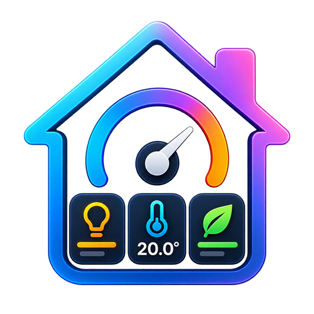
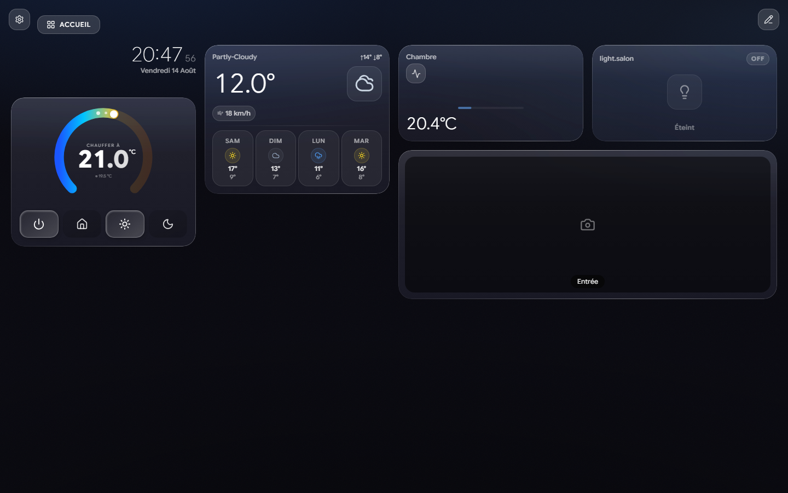
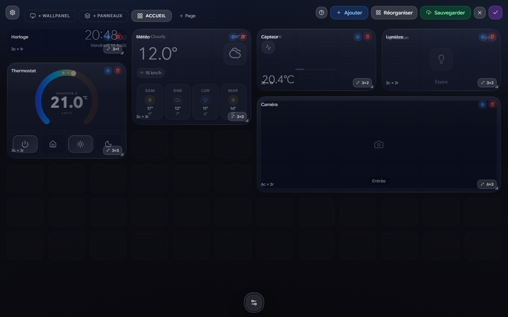
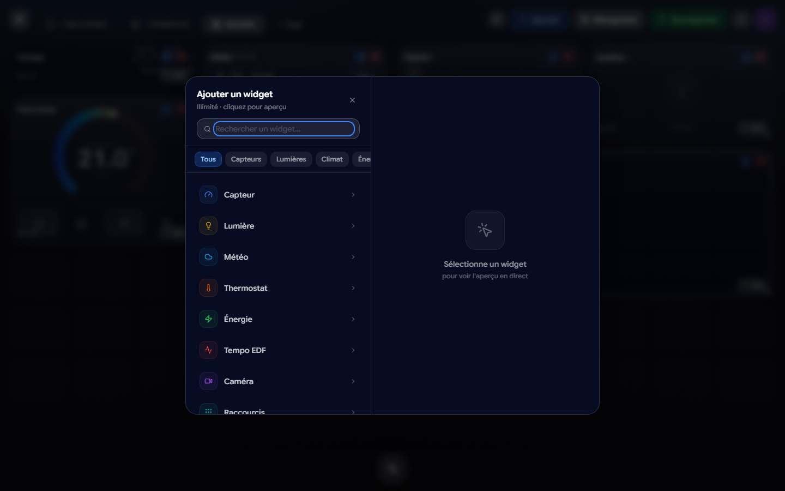
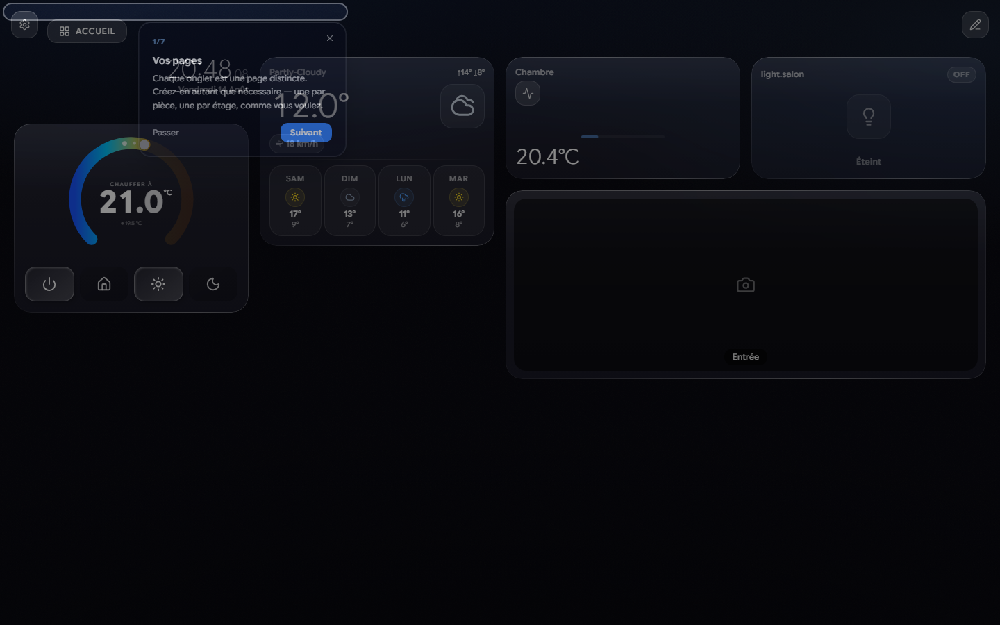
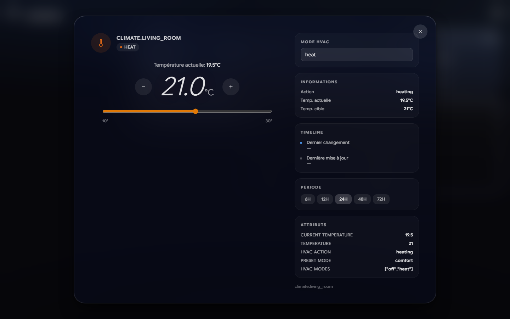
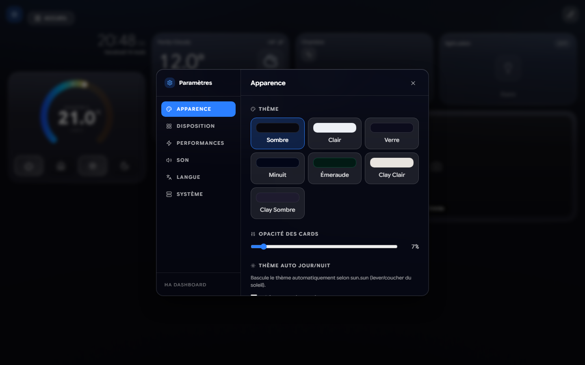

<div align="center">



# HA React Dashboard

**Un tableau de bord React pour Home Assistant** — grille réorganisable à la souris,
widgets configurables, panneaux sur mesure, mise à jour en temps réel.

</div>



> Toutes les captures de ce README sont produites depuis l'environnement de test
> à entités simulées (`SCREENSHOTS=1 npx playwright test --config playwright.dashboard.config.ts screenshots`).
> Aucune donnée d'une vraie installation n'y figure.

## Aperçu

| Mode édition | Catalogue de widgets |
|---|---|
|  |  |
| Déplacez et redimensionnez chaque card. Chaque taille d'écran garde sa disposition. | Lumières, caméras, capteurs, thermostats… reliés à l'entité de votre choix. |

| Visite guidée | Fiche détaillée |
|---|---|
|  |  |
| Au premier lancement, puis à la demande depuis le bouton d'aide. | Historique, attributs et commandes, au clic sur une card. |



## ✨ Features

- ✅ **Responsive CSS Grid** — Auto-layout on mobile, tablet, desktop
- ✅ **Drag-and-Drop** — Rearrange widgets in edit mode
- ✅ **Add/Remove Widgets** — Customize your dashboard
- ✅ **Real-time Updates** — WebSocket integration with Home Assistant
- ✅ **Cloud Storage** — Save layout to Home Assistant (per-user)
- ✅ **No Authentication (Add-on mode)** — Automatic HA session management
- ✅ **Dark Theme** — Tailwind CSS + custom theme
- ✅ **Storybook Stories** — All components documented

---

## 🚀 Installation

### **Option 1: Lovelace dashboard via HACS (Recommended)** ⭐

C'est la seule option qui produit un **vrai tableau de bord Lovelace**, donc la seule
qui permet « définir par défaut sur cet appareil » — ouvrir l'application Home
Assistant sur son téléphone arrive directement sur le dashboard, en plein écran,
sans en-tête ni barre latérale.

> Un panneau d'add-on (ingress) ou un panneau custom **ne peut pas** être défini
> comme tableau de bord par défaut : le sélecteur de HA ne liste que les tableaux
> de bord Lovelace.

#### Étapes

1. **Ajouter le dépôt à HACS**
   - HACS → Intégrations → ⋮ → **Dépôt personnalisé**
   - URL : `https://github.com/thomasv04/ha-react-dashboard`
   - Catégorie : **Integration**
   - Installer **HA React Dashboard**, puis redémarrer Home Assistant

2. **Ajouter l'intégration**
   - Paramètres → Appareils et services → **Ajouter une intégration** → *HA React Dashboard*
   - Elle crée le tableau de bord **React Dashboard** (visible dans la barre latérale),
     sert le bundle et expose l'API de persistance.

3. **En faire le tableau de bord par défaut**
   - Depuis **chaque** téléphone/tablette : Paramètres → Tableaux de bord →
     *React Dashboard* → **Définir par défaut sur cet appareil**

#### Ce que fait l'intégration

| | |
|---|---|
| Bundle | Servi sous `/ha_react_dashboard_static/`, injecté dans le frontend. L'entrée fait 1,5 ko : le dashboard lui-même (≈ 250 ko gz) n'est téléchargé qu'à l'ouverture de la carte. |
| Tableau de bord | `config/ha_react_dashboard/dashboard.yaml`, une vue en mode panneau contenant `type: custom:ha-react-dashboard-panel`. Modifiable à la main, jamais réécrit. |
| Plein écran | La carte masque l'en-tête et la barre latérale de HA. Réglable **par appareil** depuis le dashboard : Paramètres → Disposition → Plein écran. `kiosk: false` sur la carte ne change que le défaut. |
| Persistance | `/api/ha_react_dashboard/*` (config, profils, réglages par appareil, traductions, téléversements) → `.storage/ha_react_dashboard`, avec l'authentification HA. |

> ⚠️ Les icônes SVG téléversées ne sont pas prises en charge dans ce mode
> (PNG/WebP uniquement) : les nettoyer demanderait un parseur côté Python.

---

### **Option 2: Home Assistant Add-on**

The dashboard runs **directly inside Home Assistant** with no token required, automatic session management, and persistent storage.

#### Prerequisites
- Home Assistant OS or Home Assistant Container
- Admin access to add custom repositories

#### Steps

1. **Add Custom Repository**
   - Settings → Add-ons → **Add-on Store** → ⋮ → **Repositories**
   - URL: `https://github.com/thomasv04/ha-react-dashboard`
   - Un dépôt d'add-on n'a **pas** de catégorie. Celle-ci n'existe que dans le
     dialogue « dépôt personnalisé » de HACS, où il faut choisir **Integration**
     — pas *Dashboard*, qui déposerait l'intégration dans `www/community/` où
     Home Assistant ne la chargera jamais.

2. **Install Add-on**
   - Go to **Add-ons Store** tab
   - Search for **"HA React Dashboard"**
   - Click **Install**

3. **Start & Configure**
   - Open dashboard on the **Info** tab
   - Or navigate to: `http://homeassistant.local:8123/local/ha-react-dashboard/`

**No configuration needed!** The add-on automatically connects to your local HA instance.

---

### **Option 3: Manual SSH Deploy**

Build locally, upload via SSH to your Home Assistant instance.

#### Prerequisites
- Node.js ≥18.0
- npm ≥7.0
- SSH access to Home Assistant

#### Setup

1. **Clone & Configure**
   ```bash
   git clone https://github.com/thomasv04/ha-react-dashboard.git
   cd ha-react-dashboard
   cp .env.example .env
   ```

2. **Fill `.env`**
   ```env
   VITE_HA_URL=http://homeassistant.local:8123
   VITE_HA_TOKEN=eyJhbGciOiJIUzI1NiIs...  # Generate from HA profile
   VITE_FOLDER_NAME=ha-dashboard
   VITE_SSH_HOSTNAME=192.168.1.100
   VITE_SSH_USERNAME=root
   VITE_SSH_PASSWORD=your_password
   ```

   **To get HA Token:**
   - Home Assistant → Settings → Profile → **Long-Lived Access Tokens**
   - Create new token → Copy to `.env`

3. **Deploy**
   ```bash
   npm install
   npm run build
   npm run deploy
   ```

4. **Access**
   - Navigate to: `http://homeassistant.local:8123/local/ha-dashboard/`

---

### **Option 4: Frontend Integration (Static Files)**

Host the built dashboard files directly in Home Assistant's `/www/` folder.

```bash
npm install
npm run build

# Copy dist/ to /config/www/ha-dashboard/
# Then add to Home Assistant dashboard or access via /local/ha-dashboard/
```

---

## 🛠️ Local Development

### Prerequisites
- Node.js ≥18.0
- npm ≥7.0

### Setup

```bash
# Install dependencies
npm install

# Create .env for local dev
cp .env.example .env

# Update VITE_HA_URL and VITE_HA_TOKEN in .env
# ⚠️ Never commit .env!
```

### Scripts

| Command | Purpose |
|---------|---------|
| `npm run dev` | Start Vite dev server with HMR (localhost:5173) |
| `npm run build` | Build production bundle to `./dist` |
| `npm run type-check` | TypeScript type checking |
| `npm run lint` | ESLint validation |
| `npm run test` | Run Vitest (watch mode) |
| `npm run test:run` | Run tests once |
| `npm run storybook` | Open Storybook (localhost:6006) |
| `npm run sync` | Sync HA entity/service types for TypeScript |
| `npm run build:panel` | Build the Lovelace card bundle into `custom_components/ha_react_dashboard/www` |
| `npm run deploy:integration` | Copie l'intégration dans `/config/custom_components` (essai sans HACS) |
| `pytest` | Tests de l'intégration Home Assistant (voir ci-dessous) |

#### Tests de l'intégration Python

Le harnais embarque **Home Assistant 2026.8.1** et exige **Python 3.14**.

```bash
npm run build:panel        # une vue sert ce bundle
python -m venv .venv-test
.venv-test/bin/pip install -r requirements-test.txt
.venv-test/bin/pytest
```

⚠️ **Linux / macOS uniquement** : `homeassistant/runner.py` importe `fcntl`, absent de Windows — HA 2026 ne s'y importe pas. Sous Windows, passer par Docker, ce qui reproduit exactement la CI :

```bash
docker run --rm -v "/$PWD://w" -w //w python:3.14-slim sh -c "pip install -q -r requirements-test.txt && pytest"
```

### Example Dev Session

```bash
# Terminal 1: Start dev server
npm run dev
# → http://localhost:5173

# Terminal 2: Run tests in watch mode
npm run test

# Terminal 3: (Optional) Start Storybook
npm run storybook
# → http://localhost:6006
```

---

## 📦 Tech Stack

- **React 19** + TypeScript
- **Vite 8** — Ultra-fast bundler
- **Tailwind CSS 4** — Utility-first styling
- **@hakit/core** — Home Assistant WebSocket integration
- **Framer Motion** — Smooth animations
- **Vitest** — Unit tests
- **Storybook 10** — Component documentation
- **ESLint + Prettier** — Code quality

---

## 🎨 Project Structure

```
ha-dashboard/
├── src/
│   ├── components/
│   │   ├── cards/          # Widget card components
│   │   ├── layout/         # Grid, panels, dashboard layout
│   │   ├── panels/         # Panel views (Lights, Climate, etc)
│   │   └── ui/             # Reusable UI components
│   ├── context/            # React context (Layout, Toast)
│   ├── hooks/              # Custom hooks
│   ├── lib/                # Utilities and helpers
│   ├── App.tsx             # Root component
│   ├── Dashboard.tsx       # Main dashboard
│   └── main.tsx            # Entry point
├── .storybook/             # Storybook configuration
├── scripts/
│   ├── deploy.ts           # SSH deploy script
│   └── sync-types.ts       # HA type sync script
├── hacs.json               # HACS add-on metadata
├── addon.json              # Home Assistant add-on manifest
├── Dockerfile              # Multi-arch add-on image
├── vite.config.ts
├── tsconfig.json
└── package.json
```

---

## 🔧 Configuration

### Environment Variables

| Variable | Required | Purpose |
|----------|----------|---------|
| `VITE_HA_URL` | Yes | Home Assistant instance URL |
| `VITE_HA_TOKEN` | No* | Long-lived access token (*not needed in add-on mode) |
| `VITE_FOLDER_NAME` | Yes | Deployment folder name |
| `VITE_NO_AUTH` | Optional | Set to `true` for add-on mode (auto-managed) |

### Supported Entity Types

Widgets are available for:
- **Lights** — Toggle, brightness, color
- **Climate** — Temperature, mode, fan speed
- **Thermostats** — Current/target temperature
- **Covers** — Shutters, blinds, garage doors
- **Cameras** — Live stream, snapshots
- **Sensors** — Temperature, humidity, energy
- **Weather** — Current conditions, forecast
- **Media Players** — Play/pause, volume
- And many more via custom widget creation

---

## 📊 Testing & Quality

### Unit Tests (Vitest)
```bash
npm run test                # Watch mode
npm run test:run           # Single run
npm run test:coverage      # Coverage report
```

### Type Safety
```bash
npm run type-check         # Full TypeScript check
npm run sync              # Sync HA types from instance
```

### Code Quality
```bash
npm run lint              # ESLint validation
npm run prettier          # Auto-format code
npm run prettier:check    # Check formatting
```

### CI/CD
- **GitHub Actions** runs tests, lint, type-check on every commit
- Add-on release builds multi-arch Docker images (amd64, aarch64)

---

## 🐛 Troubleshooting

### Dashboard not connecting to Home Assistant

**Check:**
1. `VITE_HA_URL` is correct (e.g., `http://homeassistant.local:8123`)
2. In add-on mode: Ensure HA instance is accessible via `http://homeassistant:8123`
3. In manual mode: Token is valid and not expired
4. Browser console for WebSocket connection errors

### Widgets not updating

- Check entity names are correct in widget config
- Verify Home Assistant logs for entity errors
- Restart the add-on or dev server

### Build/Deploy fails

- Clear `node_modules` and reinstall: `rm -rf node_modules && npm install`
- Check `npm run type-check` for TypeScript errors
- Verify SSH credentials for manual deploy

---

## 📝 Development Workflow

### Contributing

1. Fork the repository
2. Create a feature branch: `git checkout -b feature/my-feature`
3. Make changes + test: `npm run test`
4. Check quality: `npm run lint && npm run type-check`
5. Commit: `git commit -m "feat: add my feature"`
6. Push: `git push origin feature/my-feature`
7. Open a Pull Request

### Releases

Semantic versioning (SemVer) with automated Docker builds:

```bash
# Create a new release
git tag v1.0.0
git push origin v1.0.0

# GitHub Actions automatically:
# 1. Runs tests & lint
# 2. Builds multi-arch Docker images
# 3. Publishes to ghcr.io
# 4. Creates GitHub Release
```

---

## 📄 License

MIT License — See [LICENSE](LICENSE) for details

---

## 🙋 Support

- **GitHub Issues**: [Report bugs & request features](https://github.com/thomasv04/ha-react-dashboard/issues)
- **GitHub Discussions**: [Ask questions & share ideas](https://github.com/thomasv04/ha-react-dashboard/discussions)

---

## 🤝 Credits

Built with:
- [Home Assistant](https://www.home-assistant.io/) — Smart home platform
- [@hakit/core](https://github.com/shannonhochkins/ha-component-kit) — HA WebSocket integration
- [React](https://react.dev/) — UI framework
- [Tailwind CSS](https://tailwindcss.com/) — Styling
- [Framer Motion](https://www.framer.com/motion/) — Animations
